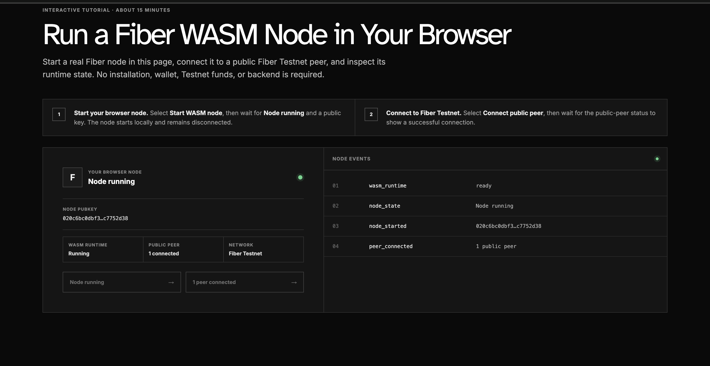
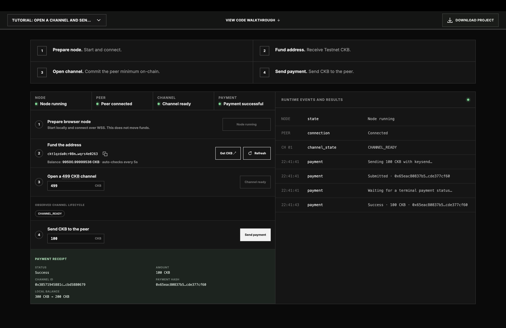
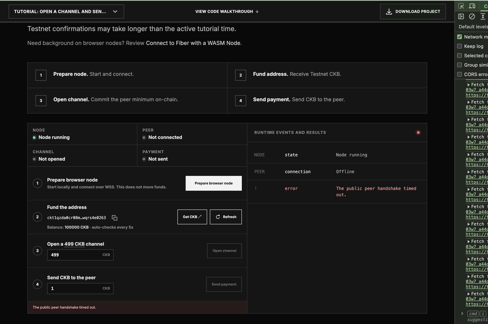
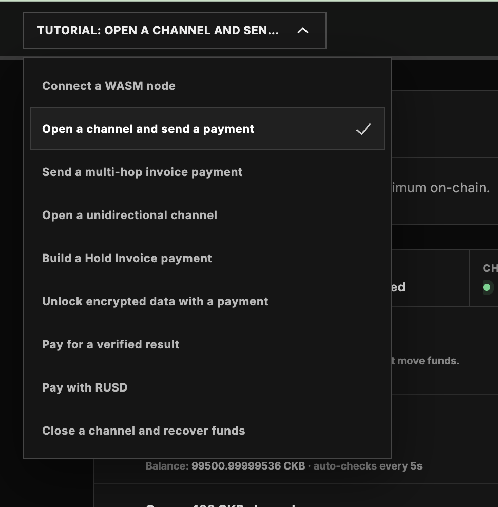

# Build on CKB campaign #06

## quest 1 proof: Connection to fiber node
### deliverables
- public key
- runtime state
- peer count
- connection events

### screenshot

## quest 2 proof: Open a channel and pay
### deliverables
- channel status as channel ready
- payment status as `success`
- the `payment receipt` including the amount, channel id, payment hash and balance change
- successful payment entry under runtime events and results

### screenshot

## Personal Reflection
two links were provided in ckboost the first one defined the connection to fiber node through the browser and the second one demonstrating how to open a channel and pay

In ckboost I saw a statement that a complete flow takes approximately 40 - 60 minutes,

although i encountered challenges, when i figured out the whole happy testing flow i realized it takes 5 minutes or less to complete

### challenges encountered
I kept getting this error, `the public peer handshake timed out` 
Then i realized that when the links are clicked differently, a certain conflict happens that doesnt allow `prepare browser node` button to function as expected when it is clicked

### how i solved it
I realized that for the whole workflow to be successful I had to run the whole operation in the same browser tab, best part, the Interactive tutorial allready compensates for that through the screenshot below, this dropdown appears at the top left of the platform

### aspects of fiber I'm most interested in the most after completing the campaign
Fiber transactions are relatively fast. the catch happens when someone makes a connection and opens a channel. It takes a little time for the connection and the channels to establish
I'm interested in figuring out why establishing a connection takes a longer time and whether there is a way an improvement can be made in that area

### What I would be interested in building with a browser-based fiber node
I'd build a spending guard for AI agents that pay with fiber, a browser node with hard limits in code something like daily caps, allowed recipients and the maximum that can be paid, I would also build a test suit that would attack the agent with prompt injections to check the limit hold.

### What I would improve about the tutorials of fiber

I would notify new users about the one tab rule and add a short troubleshooting section that would list the kind of errors a beginner is likely to hit and the procedures he could take to solve them.